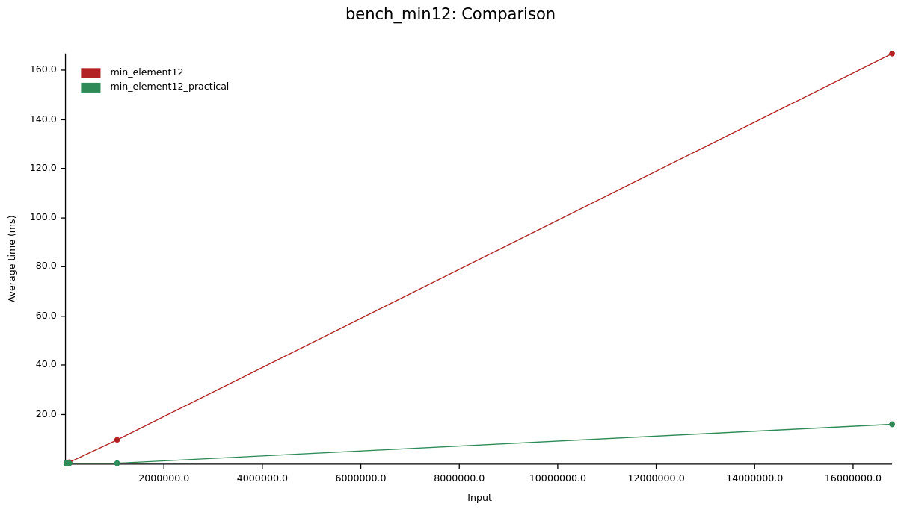

# min_element12

There is a C++ implementation closely following the code in the course and then two Rust implementations.
One is a port of the C++ `min_element12` to Rust and the other is a port of the C++ `min_element12_practical` from the lectures to Rust.

The two Rust implementations were benchmarked:

